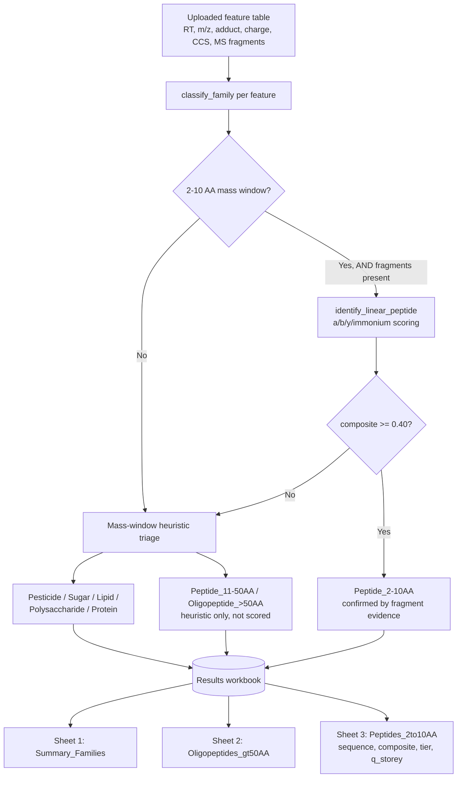

# 🧪 Wine FeatureTriage — Family Classification & 2-10 AA Peptide Scoring for UHPLC-RP Feature Tables

> *Step 3c of the Wine Peptidome series — family triage (pesticides, lipids, polysaccharides, sugars, proteins, peptides) and a/b/y/immonium fragment-informed scoring of 2-10 AA peptide candidates, applied to full untargeted UHPLC-RP feature tables from wine lees.*

[](https://www.python.org/)
[](https://github.com/314Olamda/WineFeatureTriage/blob/main/LICENSE)
[](https://pyteomics.readthedocs.io/)
[](https://orcid.org/0000-0002-7720-3733)
[](https://314olamda-winefeaturetriage.streamlit.app)

---

## 🩹 Changelog

**[Unreleased] — ppm-scaled ion matching tolerance**

Fixes the issue flagged below under *Known limitations* ("Fixed Da tolerance, not ppm-scaled"), caught via the `Ion_Evidence` sheet: a MEDIUM-tier call had several ions matching only at 21–27 ppm error while still passing the old flat 0.02 Da window — far looser than the sub-1 ppm seen on HIGH-tier calls, because a flat Da tolerance is simultaneously too loose at high mass and too tight at low mass.

- `linear_peptide_scoring.py`: `score_spectrum_vs_linear()` and `ion_evidence_table()` now take `tol_ppm` (default 15) and `tol_da_floor` (default 0.008 Da, protecting low-mass immonium ions from an unrealistically tight ppm window) instead of a single flat `tol` in Da. `Ion_Evidence` output gains a `match_window_Da` column showing the actual per-ion window used, so a borderline call is visible directly in the sheet.
- **Status: partial.** The scoring/evidence module itself is fixed and independently testable (see its `__main__` self-test, which now includes a +20 ppm shift demo). The caller wiring is **not yet updated**: `wine_feature_classifier.py`'s two call sites (`classify_family()` → `identify_linear_peptide()`, and `process_feature_table()` → `ion_evidence_table()`) still pass a flat `tol=tol` and need to thread `tol_ppm`/`tol_da_floor` through instead. Whether `linear_denovo.py`'s `identify_linear_peptide()` does its own separate ion matching internally (and would need the same fix) hasn't been checked yet. **End-to-end pipeline behavior is unchanged until both of those are done.**

---

## 🌐 Try it online — no Python required

**[314olamda-winefeaturetriage.streamlit.app](https://314olamda-winefeaturetriage.streamlit.app)** *(update this link once deployed — see Deployment section below)*

Upload a filled feature table, click Run, download the results workbook. No installation, no command line, no cloning this repo. This is the fastest way to use the tool if you're not planning to modify the code.

The sections below cover running it locally instead (for development, customization, or if you want to raise the search-thoroughness parameters beyond what the web version exposes).

---

## 🍷 Where this fits in the Wine Peptidome series

| Step   | Repository                                                  | What it does                                                                                                                                              |
| ------ | ------------------------------------------------------------ | ------------------------------------------------------------------------------------------------------------------------------------------------------ |
| 1      | [WinePeptidome](https://github.com/314Olamda/WinePeptidome)  | Retrieves *S. cerevisiae* & *V. vinifera* proteins (500 Da – 100 kDa) from UniProt REST API + Proteins API                                               |
| 2      | [WineStructure](https://github.com/314Olamda/WineStructure)  | AlphaFold 3D structures + per-residue pLDDT confidence                                                                                                    |
| 3      | [WineCycloPep](https://github.com/314Olamda/WineCycloPep)    | De novo **cyclic** peptide detection from Bruker `.d` files — bn-ion rotations, FDR, 3D conformers                                                       |
| 3b     | [WineLinearPep](https://github.com/314Olamda/WineLinearPep)  | De novo **linear** peptide identification for a single spectrum — a/b/y/immonium scoring, target-decoy FDR                                              |
| **3c** | **WineFeatureTriage ← you are here**                          | Applies WineLinearPep's engine across a **whole untargeted feature table** — family triage first, then 2-10 AA scoring on the peptide-consistent subset |

---

## 🔬 Why this sits above WineLinearPep rather than inside it

WineLinearPep answers *"is this one spectrum a 2-10 AA peptide, and which sequence?"* — it needs a precursor mass and a fragment list already isolated as a candidate. Real UHPLC-RP untargeted runs don't hand you that: a single feature table mixes pesticides, lipids, polysaccharide fragments, sugars, intact proteins, long oligopeptides, and short peptides together, with **no prior annotation**. WineFeatureTriage is the layer that takes a raw, unannotated feature table and decides *which* features are even worth handing to WineLinearPep's scoring engine — plus classifies everything else into its likely chemical family for a first-pass overview.

---

## 🧬 Pipeline architecture



---

## ⚡ Quick start (local / command line)

If you want to run this yourself rather than using the hosted web app:

```bash
# 1. Clone
git clone https://github.com/314Olamda/WineFeatureTriage.git
cd WineFeatureTriage

# 2. Install dependencies
pip install pyteomics numpy scipy pandas openpyxl

# 3. Generate a synthetic test feature table (no real data needed)
python generate_template.py
# -> UHPLC_RP_Wine_Template.xlsx (unannotated, 77 features across all families)

# 4. Run the triage + scoring tool on it
python wine_feature_classifier.py UHPLC_RP_Wine_Template.xlsx WineFeature_Results.xlsx
```

To run on your own uploaded feature table, it just needs to match the same column layout (see **Input format** below) — point the script at it instead of the generated template.

Running locally lets you set `n_decoys`, `max_perms_per_composition`, and `max_compositions` higher than the web app's sliders allow, trading runtime for recall (see **Scaling for production**).

---

## 🖥️ Running the web app locally (optional)

To test `streamlit_app.py` on your own machine before or instead of deploying:

```bash
pip install -r requirements.txt
streamlit run streamlit_app.py
```

Opens at `http://localhost:8501`.

---

## 🚀 Deploying your own instance

1. Push `streamlit_app.py`, `requirements.txt`, `wine_feature_classifier.py`, `linear_denovo.py`, `mass_utils.py`, and `linear_peptide_scoring.py` to this repo
2. Go to [share.streamlit.io](https://share.streamlit.io), sign in with GitHub, click **New app**
3. Point it at this repo, branch `main`, file `streamlit_app.py`
4. Deploy — you'll get a permanent URL (e.g. `314olamda-winefeaturetriage.streamlit.app`)
5. Update the badge link and the **Try it online** link at the top of this README to match

---

## 📦 Repository structure

| File                                       | Role                                                                                                                                                       |
| ------------------------------------------- | ---------------------------------------------------------------------------------------------------------------------------------------------------------- |
| `mass_utils.py`                            | Pyteomics-backed mass/ion layer (shared with WineLinearPep)                                                                                               |
| `linear_peptide_scoring.py`                | `score_spectrum_vs_linear()` — a/b/y/immonium coverage scoring (shared with WineLinearPep). **Now ppm-scaled (`tol_ppm`/`tol_da_floor`) — see Changelog.** |
| `linear_denovo.py`                         | Composition search + target-decoy FDR pipeline (shared with WineLinearPep, includes two performance fixes — see below)                                    |
| `wine_feature_classifier.py`               | **This repo's core tool** — family triage + Sheet 1/2/3 workbook generation                                                                               |
| `generate_template.py`                     | Synthetic unannotated feature table generator, for testing without real data                                                                              |
| `streamlit_app.py`                         | Web UI — upload, run, download, no local Python needed (see **Try it online** above)                                                                      |
| `requirements.txt`                         | Dependencies for Streamlit Cloud deployment                                                                                                               |
| `example_data/UHPLC_RP_Wine_Template.xlsx` | Example input — 77 synthetic features across all families                                                                                                 |

---

## 📥 Input format

The tool expects an Excel file with a sheet named `Features` and these columns:

| Column                        | Description                                                              |
| ------------------------------ | -------------------------------------------------------------------------- |
| `Feature_ID`                  | Unique identifier                                                        |
| `RT_min`                      | Retention time, minutes                                                  |
| `m/z`                         | Observed m/z                                                             |
| `Adduct`                      | `[M+H]+`, `[M+Na]+`, or `[M+NH4]+`                                       |
| `Charge`                      | Charge state                                                             |
| `CCS_A2`                      | Collision cross-section, Ų                                              |
| `MS_Fragments (mz:intensity)` | Semicolon-separated `mz:intensity` pairs, e.g. `44.049:1000;72.045:5000` |

No `Compound_name`, `Sequence_peptide`, or annotation columns are expected or used — this tool is designed for **pre-annotation** triage.

---

## 📊 Output: the results workbook

| Sheet                     | Content                                                                                                                                                                       |
| --------------------------- | -------------------------------------------------------------------------------------------------------------------------------------------------------------------------- |
| **Summary\_Families**     | Feature count and % of total per predicted family (Pesticide, Lipid, Polysaccharide, Sugar, Protein, Peptide\_11-50AA, Oligopeptide\_>50AA, Peptide\_2-10AA)                |
| **Oligopeptides\_gt50AA** | Features consistent with a linear peptide >50 AA — flagged, not scored (outside this tool's fragment-scoring scope)                                                         |
| **Peptides\_2to10AA**     | Every feature confirmed as a 2-10 AA peptide by fragment evidence, with top candidate sequence, composite score, confidence tier, `q_storey`, and isobaric-tie flags        |
| **Ion\_Evidence**         | The audit trail behind each score: one row per a/b/y/immonium ion checked for every top candidate — theoretical m/z, observed m/z, Δ Da, Δ ppm, **match window (Da)**, intensity, and matched/not |

The web app also displays `Ion_Evidence` inline as an expandable table per feature, so you can see exactly why a sequence was called before downloading anything.

---

## ⚙️ Classification logic — and why it isn't mass-alone

Family triage for pesticide/lipid/sugar/polysaccharide/protein uses **mass-window heuristics only** — a reasonable first-pass filter, not a substitute for real identification. Real triage needs spectral library matching (GNPS, MassBank, mzCloud) plus formula/isotope confirmation.

The 2-10 AA peptide tier is stricter: a feature is only called `Peptide_2-10AA` if its **fragment ions actually support** a b/y/a/immonium composite score ≥ 0.40 — a matching precursor mass alone is not sufficient. This was a real bug caught during development: at masses in the 700-1500 Da range, hundreds to thousands of amino-acid compositions can match a given mass within 0.02 Da purely by coincidence, so mass-only classification mislabeled sugars and lipids as peptides. Requiring fragment-supported scoring above threshold fixed this.

**Validated accuracy** (synthetic test set, 77 features): **100% precision**, **~12% recall** on 2-10 AA calls. The precision means every call the tool makes is trustworthy; the recall gap is a direct consequence of runtime caps (`max_compositions=15`, `max_perms_per_composition=15`) needed for interactive use — see **Scaling for production** below. Every call's reasoning is auditable via the `Ion_Evidence` sheet / in-app expander (see Output section above) — nothing is a black-box score. *(Note: this accuracy figure predates the ppm-tolerance patch above and hasn't been re-measured against it yet — worth re-running once the caller wiring is updated.)*

---

## 🚀 Scaling for production

This tool is deliberately capped for fast, synchronous use. At masses where thousands of isobaric compositions exist, the capped search won't always surface the true composition. The **web app exposes `n_decoys`, `max_perms_per_composition`, and `max_compositions` as sliders** — raise them there for better recall on a real dataset, at the cost of a slower run. Running locally or via a background job (e.g. GitHub Actions) removes the practical ceiling on how high you can push them:

```python
process_feature_table(
    input_path, output_path,
    n_decoys=100,
    max_perms_per_composition=200,
    max_compositions=500,   # matches linear_denovo.py's original defaults
)
```

This trades runtime (minutes instead of seconds for a full feature table) for substantially higher recall, with no change to the underlying scoring logic.

---

## 🐛 Two performance fixes in `linear_denovo.py`

Found and fixed while building this tool — both are real algorithmic issues, not specific to this repo:

1. **Branch-and-bound composition search iterated alphabetically, not by mass.** This made mass-based pruning unsafe and left real queries taking 2-16 seconds at mid-range masses. Fixed by sorting residues by mass ascending, enabling early `break` once a residue would overshoot the target, plus an upper-bound prune on remaining slots.
2. **Factorial blowup in permutation/decoy generation.** `itertools.permutations()` was called on the full sequence before sampling — for a 10-residue composition with distinct residues, that's up to 3.6 million permutations enumerated to keep a handful. Fixed with a length threshold (exact enumeration ≤ 8 residues, direct random sampling above that).

---

## ⚠️ Known limitations

- **Recall vs. runtime tradeoff** (see Scaling for production above).
- **I/L isobaric ambiguity** is reported, not resolved — expect tied top candidates when a composition contains I or L. Disambiguation requires orthogonal evidence (retention time, ion mobility 1/K₀, chemical derivatization). *Note: the feature table already carries a `CCS_A2` column that isn't currently used anywhere in `classify_family()` or scoring — a natural next step toward resolving this, not yet implemented.*
- **Non-peptide family triage is heuristic**, not a confirmed identification — treat `Summary_Families` as a first-pass overview to prioritize what needs real spectral library confirmation, not a final annotation.
- ~~**Fixed Da tolerance, not ppm-scaled.**~~ **Partially fixed — see Changelog above.** `linear_peptide_scoring.py` now uses `tol_ppm`/`tol_da_floor`; `wine_feature_classifier.py`'s call sites and `linear_denovo.py`'s internal matching (if any) still need updating before this is a pipeline-wide fix. Until then, still check `delta_ppm` / the new `match_window_Da` column in `Ion_Evidence` manually for borderline calls.

---

## 🔗 Series & related resources

- **Step 3b (single-spectrum scoring engine):** [WineLinearPep](https://github.com/314Olamda/WineLinearPep)
- **Step 3 (cyclic counterpart):** [WineCycloPep](https://github.com/314Olamda/WineCycloPep)
- [Pyteomics](https://pyteomics.readthedocs.io/) — mass calculation engine underlying this pipeline
- [GNPS molecular networking](https://gnps.ucsd.edu/) — downstream spectral annotation
- [reLees project](https://relees.uniwa.gr) — wine lees circular economy research

---

## 📄 Citation

```bibtex
@software{gimenez_gil_wine_featuretriage_2025,
  author  = {Giménez-Gil, Pol},
  title   = {Wine FeatureTriage: Family Classification and 2-10 AA Peptide Scoring for UHPLC-RP Feature Tables},
  year    = {2025},
  url     = {https://github.com/314Olamda/WineFeatureTriage},
  orcid   = {0000-0002-7720-3733},
  note    = {Step 3c of the Wine Peptidome series. Scoring engine: github.com/314Olamda/WineLinearPep}
}
```

---

## 👤 Author

**Pol Giménez-Gil**, PhD
Postdoctoral Researcher — ISVV, Université de Bordeaux
Scopus ID: 57219336109 · ORCID: [0000-0002-7720-3733](https://orcid.org/0000-0002-7720-3733) · ResearchGate: [Pol_Gimenez2](https://www.researchgate.net/profile/Pol_Gimenez2)

---

## 📜 License

MIT — see [LICENSE](https://github.com/314Olamda/WineFeatureTriage/blob/main/LICENSE)
